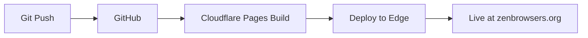

# 🚀 Cloudflare Deployment Checklist - ZENO Browser

## ✅ Completed Steps

- [x] **DNS Setup** - zenbrowsers.org configured with Cloudflare nameservers
- [x] **Git Repository** - Pushed to GitHub main (commit 1a2490c)
- [x] **Configuration Files** - wrangler.toml, pages.config.md, setup.ps1 created
- [x] **Database Schema** - schema.sql ready with 23 sites
- [x] **Worker API** - 7 endpoints implemented (340+ lines)

## 📋 Next Steps (in order)

### 1. Cloudflare Account Setup (5 min)

```powershell
# Navigate to .cloudflare directory
cd V:\PROTO_TYpy\ZENO_web_CORE\.cloudflare

# Run automated setup script
.\setup.ps1
```

**What the script does:**
- ✅ Checks/installs Wrangler CLI
- ✅ Logs you into Cloudflare
- ✅ Creates D1 database: `zeno-browser-db`
- ✅ Imports schema with 23 sites
- ✅ Creates KV namespace: `CACHE`
- ✅ Updates wrangler.toml with IDs
- ✅ Prompts for API keys (Gemini, OpenAI, Anthropic, Tavily)

**If you prefer manual setup:**
```powershell
# 1. Install Wrangler
npm install -g wrangler

# 2. Login
wrangler login

# 3. Create D1 database
wrangler d1 create zeno-browser-db
# Copy database_id and paste into wrangler.toml

# 4. Import schema
wrangler d1 execute zeno-browser-db --file=../zenbrowsers_full_boilerplate/backend/schema.sql

# 5. Create KV namespace
wrangler kv:namespace create CACHE
wrangler kv:namespace create CACHE --preview
# Copy IDs and paste into wrangler.toml

# 6. Set API keys
wrangler secret put GEMINI_API_KEY
wrangler secret put OPENAI_API_KEY
wrangler secret put ANTHROPIC_API_KEY
wrangler secret put TAVILY_API_KEY
```

---

### 2. Deploy Worker API (2 min)

```powershell
# Still in .cloudflare directory
cd V:\PROTO_TYpy\ZENO_web_CORE\.cloudflare

# Deploy the Worker
wrangler deploy
```

**Expected output:**
```
✨ Built successfully
🌍 Uploading...
✨ Success! Deployed to:
   https://zeno-browser-api.<your-subdomain>.workers.dev
```

**Verify deployment:**
```powershell
# Test health endpoint
curl https://zeno-browser-api.<your-subdomain>.workers.dev/health

# Should return: {"status":"ok","timestamp":"..."}
```

---

### 3. Create Cloudflare Pages Project (5 min)

**Option A: Via Cloudflare Dashboard (Recommended)**

1. Go to: https://dash.cloudflare.com/
2. Click **Workers & Pages** → **Create application** → **Pages** → **Connect to Git**
3. Select your GitHub repository: `Bonzokoles/zen-bro-wser.org`
4. Configure build settings:

```yaml
Framework preset: Astro
Build command: npm run build
Build output directory: dist
Root directory: ZENO_WEB_CORE_APP
Node version: 18
```

5. Add environment variables:

```env
NODE_VERSION=18
VITE_API_URL=https://zeno-browser-api.<your-subdomain>.workers.dev
VITE_ENVIRONMENT=production
```

6. Click **Save and Deploy**

**Option B: Via Wrangler CLI**

```powershell
cd V:\PROTO_TYpy\ZENO_web_CORE\ZENO_WEB_CORE_APP

# Create Pages project
wrangler pages project create zeno-browser --production-branch=main

# Deploy
wrangler pages deploy dist --project-name=zeno-browser
```

---

### 4. Configure Custom Domain (3 min)

1. Go to: https://dash.cloudflare.com/ → **Workers & Pages** → **zeno-browser**
2. Click **Custom domains** → **Set up a custom domain**
3. Enter: `zenbrowsers.org` or `www.zenbrowsers.org`
4. Click **Activate domain**

**Cloudflare will automatically:**
- ✅ Create necessary DNS records
- ✅ Provision SSL certificate (1-2 minutes)
- ✅ Enable HTTP/2 and HTTP/3
- ✅ Enable Cloudflare CDN

**Verify SSL:**
- Wait 2-5 minutes for SSL provisioning
- Visit: https://zenbrowsers.org
- Check for 🔒 in browser

---

### 5. Verify Full Deployment (5 min)

**Test Worker API endpoints:**

```powershell
# 1. Health check
curl https://zeno-browser-api.<your-subdomain>.workers.dev/health

# 2. List all sites
curl https://zeno-browser-api.<your-subdomain>.workers.dev/api/admin/sites

# 3. Search sites
curl "https://zeno-browser-api.<your-subdomain>.workers.dev/api/iframe/sites?q=code&category=development"

# 4. Filter iframe-friendly sites
curl "https://zeno-browser-api.<your-subdomain>.workers.dev/api/iframe/sites?iframeAllowed=true"

# 5. Test pagination
curl "https://zeno-browser-api.<your-subdomain>.workers.dev/api/iframe/sites?page=1&limit=10"
```

**Test frontend pages:**

1. Home page: https://zenbrowsers.org
2. Search demo: https://zenbrowsers.org/search-demo
3. Advanced search: https://zenbrowsers.org/advanced-search
4. Admin panel: https://zenbrowsers.org/admin

**Check KV cache:**
```powershell
wrangler kv:key list --binding=CACHE
```

**Check D1 data:**
```powershell
wrangler d1 execute zeno-browser-db --command="SELECT COUNT(*) FROM sites"
# Should return: 23
```

---

### 6. Monitor & Debug (ongoing)

**Real-time logs:**
```powershell
wrangler tail
# Shows all requests, responses, and errors in real-time
```

**Cloudflare Dashboard:**
- Analytics: https://dash.cloudflare.com/analytics
- Logs: https://dash.cloudflare.com/workers/logs
- D1 Console: https://dash.cloudflare.com/d1
- KV Browser: https://dash.cloudflare.com/kv/namespaces

**Common issues:**

1. **404 on API calls** → Check VITE_API_URL in Pages environment variables
2. **CORS errors** → Worker includes CORS headers, check browser console
3. **Database empty** → Re-import schema: `wrangler d1 execute zeno-browser-db --file=schema.sql`
4. **Worker errors** → Check `wrangler tail` for detailed error logs
5. **Build fails** → Check Pages deployment logs in dashboard

---

## 🎯 Quick Commands Reference

```powershell
# View Worker logs
wrangler tail

# View deployments history
wrangler deployments list

# Rollback Worker
wrangler rollback

# Check D1 database
wrangler d1 execute zeno-browser-db --command="SELECT * FROM sites LIMIT 5"

# List KV keys
wrangler kv:key list --binding=CACHE

# Get specific KV value
wrangler kv:key get "search:code" --binding=CACHE

# Update secret
wrangler secret put GEMINI_API_KEY

# List secrets
wrangler secret list

# Pages deployments
wrangler pages deployment list --project-name=zeno-browser

# Redeploy Pages
cd ZENO_WEB_CORE_APP
npm run build
wrangler pages deploy dist --project-name=zeno-browser
```

---

## 📊 Expected Results

After completing all steps, you should have:

✅ **Worker API running at:**
- https://zeno-browser-api.<your-subdomain>.workers.dev
- 7 endpoints operational
- D1 database with 23 sites
- KV cache with 5-minute TTL

✅ **Frontend running at:**
- https://zenbrowsers.org
- https://www.zenbrowsers.org
- Automatic deployments on `git push`

✅ **Features working:**
- Search with filters & pagination
- Admin panel with CRUD operations
- Iframe testing & text selection
- AI chat integration (if API keys set)
- MCP tools (6 tools)

✅ **Performance:**
- Global CDN (Cloudflare's 300+ locations)
- HTTP/2 & HTTP/3 enabled
- Automatic SSL
- Edge caching
- ~50ms response times globally

---

## 🔄 CI/CD Workflow (automatic after setup)



**Every `git push origin main` automatically:**
1. Triggers Cloudflare Pages build
2. Runs `npm run build` in ZENO_WEB_CORE_APP
3. Deploys to global edge network
4. Updates https://zenbrowsers.org
5. Sends deployment notification

**No manual deployment needed after initial setup!**

---

## 🆘 Support & Documentation

- **Cloudflare Docs**: https://developers.cloudflare.com
- **Wrangler Docs**: https://developers.cloudflare.com/workers/wrangler
- **D1 Docs**: https://developers.cloudflare.com/d1
- **Pages Docs**: https://developers.cloudflare.com/pages

- **Project Docs**:
  - `zenbrowsers_full_boilerplate/README.md` - Full deployment guide
  - `zenbrowsers_full_boilerplate/QUICKSTART.md` - 10-minute guide
  - `ZENO_WEB_CORE_APP/PROJECT_STRUCTURE.md` - Application structure

- **Community**:
  - Cloudflare Discord: https://discord.gg/cloudflaredev
  - Cloudflare Community: https://community.cloudflare.com

---

## 🎉 Success Checklist

Before considering deployment complete, verify:

- [ ] `wrangler whoami` shows your account
- [ ] D1 database has 23 sites
- [ ] Worker health endpoint returns `{"status":"ok"}`
- [ ] All 7 API endpoints return valid JSON
- [ ] KV namespace exists and is writable
- [ ] Frontend loads at https://zenbrowsers.org
- [ ] Custom domain has valid SSL certificate
- [ ] API calls from frontend work (check Network tab)
- [ ] Admin panel CRUD operations work
- [ ] Search with filters works
- [ ] `wrangler tail` shows live traffic

**When all checked, deployment is COMPLETE!** 🚀
