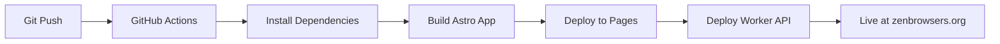

# GitHub Actions - Automated Cloudflare Deployment

## 🚀 Workflow Overview

This repository uses GitHub Actions to automatically deploy to Cloudflare on every push to `main` branch.

### What gets deployed:
1. **Frontend** (Astro/React app) → Cloudflare Pages
2. **Worker API** (7 endpoints) → Cloudflare Workers

---

## 🔑 Required GitHub Secrets

Go to: **Repository Settings → Secrets and variables → Actions → New repository secret**

### 1. `CLOUDFLARE_API_TOKEN`
**How to create:**
1. Go to: https://dash.cloudflare.com/profile/api-tokens
2. Click **Create Token**
3. Use template: **Edit Cloudflare Workers**
4. Or create custom token with permissions:
   - Account → Cloudflare Pages → Edit
   - Account → Workers Scripts → Edit
   - Account → D1 → Edit
   - Account → Workers KV Storage → Edit
5. Copy the token and add as GitHub secret

### 2. `CLOUDFLARE_ACCOUNT_ID`
**How to find:**
```powershell
# Option 1: Via Wrangler CLI
wrangler whoami

# Option 2: Via Dashboard
# Go to: https://dash.cloudflare.com
# Look at URL: https://dash.cloudflare.com/<ACCOUNT_ID>/...
# Copy the hex string (32 characters)
```

### 3. `VITE_API_URL` (optional)
Your Worker API URL:
```
https://zeno-browser-api.<your-subdomain>.workers.dev
```
Or after custom domain setup:
```
https://api.zenbrowsers.org
```

---

## 📋 Setup Checklist

- [ ] **Create Cloudflare API Token** with Workers/Pages permissions
- [ ] **Add `CLOUDFLARE_API_TOKEN`** to GitHub Secrets
- [ ] **Add `CLOUDFLARE_ACCOUNT_ID`** to GitHub Secrets
- [ ] **Add `VITE_API_URL`** to GitHub Secrets (optional)
- [ ] **Run initial setup**: `cd .cloudflare && .\setup.ps1`
- [ ] **Create D1 database** (via setup.ps1 or manually)
- [ ] **Create KV namespace** (via setup.ps1 or manually)
- [ ] **Push to main branch** to trigger first deployment

---

## 🔄 Deployment Flow



### Trigger conditions:
- ✅ Push to `main` branch
- ✅ Pull Request to `main` (preview deployment)
- ✅ Manual trigger via Actions tab

---

## 📊 Monitoring Deployments

### GitHub Actions:
- View workflow runs: https://github.com/Bonzokoles/zen-bro-wser.org/actions
- Check deployment status
- View build logs

### Cloudflare Dashboard:
- Pages: https://dash.cloudflare.com/pages
- Workers: https://dash.cloudflare.com/workers
- Analytics: https://dash.cloudflare.com/analytics

---

## 🐛 Troubleshooting

### Build fails with "npm ci" error:
**Solution:** Ensure `package-lock.json` is committed in `ZENO_WEB_CORE_APP/`

### "Invalid API Token" error:
**Solution:** 
1. Verify token has correct permissions (Workers Edit + Pages Edit)
2. Check token hasn't expired
3. Regenerate token if needed

### "Account ID not found" error:
**Solution:**
```powershell
# Get correct Account ID
wrangler whoami

# Update GitHub secret with correct ID
```

### Worker deployment fails:
**Solution:**
1. Ensure D1 database exists: `wrangler d1 list`
2. Ensure KV namespace exists: `wrangler kv:namespace list`
3. Update `.cloudflare/wrangler.toml` with correct IDs

### Frontend builds but doesn't connect to API:
**Solution:**
1. Check `VITE_API_URL` secret in GitHub
2. Verify Worker is deployed: `curl https://your-worker.workers.dev/health`
3. Check CORS headers in Worker response

---

## 🔧 Manual Deployment (Backup)

If GitHub Actions fails, you can deploy manually:

```powershell
# 1. Deploy Worker API
cd V:\PROTO_TYpy\ZENO_web_CORE\.cloudflare
wrangler deploy

# 2. Build frontend
cd ..\ZENO_WEB_CORE_APP
npm run build

# 3. Deploy to Pages
wrangler pages deploy dist --project-name=zeno-browser
```

---

## 🎯 Deployment URLs

After successful deployment:

- **Production**: https://zenbrowsers.org
- **Pages Preview**: https://zeno-browser.pages.dev
- **Worker API**: https://zeno-browser-api.workers.dev
- **PR Previews**: https://<pr-number>.zeno-browser.pages.dev

---

## 📚 Resources

- [GitHub Actions Docs](https://docs.github.com/en/actions)
- [Cloudflare Pages Action](https://github.com/cloudflare/pages-action)
- [Wrangler Action](https://github.com/cloudflare/wrangler-action)
- [Cloudflare Workers Docs](https://developers.cloudflare.com/workers)
- [Cloudflare Pages Docs](https://developers.cloudflare.com/pages)

---

## 🔄 Update Workflow

To modify deployment workflow:

1. Edit `.github/workflows/deploy.yml`
2. Commit and push to trigger
3. Monitor in Actions tab

Common modifications:
- Add environment variables
- Change Node.js version
- Add testing steps
- Add deployment notifications
- Configure caching strategies
