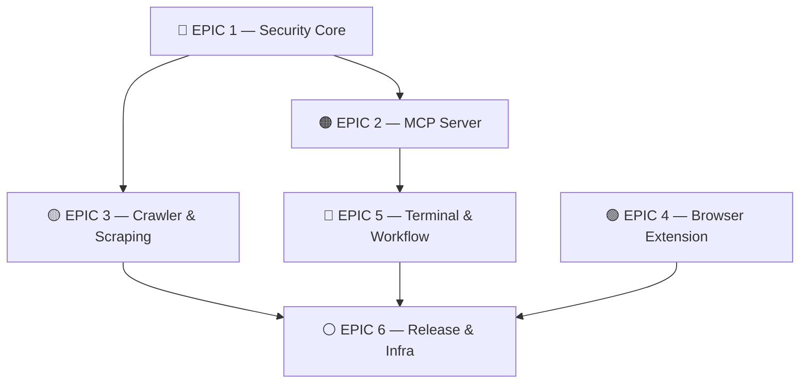

# ZENO Browser v0.2.0 — Project Plan

## 1. Project Overview

**Feature Summary:** Kompletna implementacja bezpiecznego silnika przeglądania, MCP toolchain, pipeline scrapingu, rozszerzenia przeglądarki, terminala i pipeline releasowego.

**Success Criteria:**
- API keys niewidoczne w DevTools (XSS-safe)
- 6/6 MCP tools zaimplementowanych i przetestowanych
- CAYD Search indeksowany przez crawler
- Extension zainstalowalna w Chrome/Firefox
- Electron auto-updater działa end-to-end
- CI/CD: wszystkie builds zielone

**Risk Assessment:**

| Ryzyko | Prawdopodobieństwo | Mitygacja |
|--------|-------------------|-----------|
| CSP blokuje legalne zasoby | Wysoki | Per-domain allowlist w KV |
| Playwright timeout na CI | Średni | Mock scraper w testach |
| D1 limity w CF free tier | Niski | Pagination + cleanup job |
| MV3 Extension API breaking | Średni | Feature flags, graceful fallback |

---

## 2. Diagram Zależności

---

## 3. Epiki — INVEST Stories & Definition of Done

---

### 🔴 EPIC 1 — Security Core
**P0 — Blokuje wszystko inne**

#### Story 1.1 — SandboxWebView zastępuje iframe
> *Jako użytkownik, chcę żeby załadowane strony były izolowane, żebym był chroniony przed XSS i code injection.*

**Acceptance Criteria:**
- [ ] `<SandboxWebView>` zastępuje `<iframe>` w `Browser.tsx`
- [ ] Sandbox attributes konfigurowalne per-domain
- [ ] Błędy ładowania obsługiwane gracefully (error boundary)
- [ ] Nie regresuje istniejących tabów

**DoD:** Code review, `security.test.ts` zielony, brak CSP błędów w console

---

#### Story 1.2 — CSP Header Service
> *Jako admin, chcę definiować politykę CSP per-domena, żeby zminimalizować powierzchnię ataku.*

**Acceptance Criteria:**
- [ ] `security.ts` eksportuje `generateCSP(domain): string`
- [ ] Domyślna polityka `default-src 'self'`
- [ ] Override przez KV namespace `DOMAIN_ALLOWLIST`
- [ ] Unit testy pokrywają XSS wektory (inline script, data URI, eval)

**DoD:** Testy jednostkowe, żaden znany XSS wektor nie przechodzi

---

#### Story 1.3 — Network Proxy + SSRF Protection
> *Jako system, chcę interceptować requesty sieciowe, żeby blokować SSRF i redirect ataki.*

**Acceptance Criteria:**
- [ ] `network.ts` → request interceptor blokuje `169.254.x.x`, `10.x.x.x`, `localhost`
- [ ] Open redirect detection (URL parsing przed nawigacją)
- [ ] Logowanie zablokowanych requestów
- [ ] Unit testy: SSRF payloads, open redirect chains

**DoD:** OWASP SSRF checklist zaliczony, testy zielone

---

#### Enabler 1.4 — API Keys → CF Pages Secrets
> *Jako dev, chcę żeby klucze API były w CF secrets, nie w localStorage, żeby nie wyciekały przez XSS.*

**Acceptance Criteria:**
- [ ] Usunięte `localStorage.getItem('gemini_key')` itp.
- [ ] Klucze dostępne tylko przez `/api/` endpoint (server-side)
- [ ] `.dev.vars` zaktualizowany lokalnie
- [ ] DevTools Network tab: brak kluczy w requestach frontendowych

**DoD:** Security audit: grep `localStorage` → 0 wyników dla API keys

---

### 🟠 EPIC 2 — MCP Server
**P0 — Zależy od Epic 1**

#### Enabler 2.1 — MCP Server Bootstrap
> *Jako dev, chcę uruchomić `mcp-server` jako standalone process połączony z Claude, żeby narzędzia AI działały.*

**Acceptance Criteria:**
- [ ] `mcp-server/src/index.ts` startuje bez błędów: `npm start` w `mcp-server/`
- [ ] `.claude-mcp.json` wskazuje właściwy port
- [ ] Health check endpoint `/health` zwraca 200
- [ ] Połączenie z Claude przez MCP protokół potwierdzone

**DoD:** E2E: Claude zwraca odpowiedź przez MCP tool call

---

#### Story 2.2–2.6 — 5 Nowych MCP Tools

| Tool | Story | Acceptance Criteria |
|------|-------|---------------------|
| `content_analysis` | Analizuj DOM strony → zwróć strukturę | Wynik zawiera title, h1, main text, links count |
| `web_navigation` | Nawiguj do URL przez SandboxWebView | URL ładuje się w aktywnym tabie |
| `page_summarizer` | Pobierz DOM → AI summary | Summary ≤ 3 zdania, działa na SPAch |
| `link_extractor` | Wylistuj linki ze strony | Filtruje mailto/blob, deduplicates |
| `bookmark_manager` | CRUD bookmarks w D1 | create/read/delete, paginacja ≤ 50 |

**DoD (wszystkie tools):** Unit test mock call → expected output, integration test na żywym MCP

---

### 🟡 EPIC 3 — Crawler & Scraping
**P1 — Zależy od Epic 1**

#### Story 3.1 — Crawlee Queue
> *Jako system, chcę kolejkować URLs do crawlowania z depth limit i robots.txt, żeby nie przeciążać serwerów.*

**Acceptance Criteria:**
- [ ] Queue z max depth = 3
- [ ] robots.txt parsing i respektowanie
- [ ] Rate limiting: max 2 req/s per domain
- [ ] `crawler.test.ts` pokrywa edge cases

**DoD:** Crawl 10 stron bez naruszenia robots.txt

---

#### Story 3.2 — Cheerio Parser
> *Jako system, chcę parsować HTML do structured data, żeby wyniki były dostępne dla AI.*

**Acceptance Criteria:**
- [ ] Input: raw HTML string → Output: `{title, description, headings[], links[], text}`
- [ ] Obsługa malformed HTML
- [ ] Unit testy z real HTML fixtures

---

#### Story 3.3 — Playwright Plugin (JS-rendered)
> *Jako system, chcę scrapować SPA strony z JS-rendered contentem.*

**Acceptance Criteria:**
- [ ] Headless Chromium przez Playwright
- [ ] Wait for `networkidle` przed ekstrakcją
- [ ] Timeout 10s, graceful fallback na Cheerio

---

#### Story 3.4 — CAYD Feed Integration
> *Jako użytkownik, chcę żeby wyniki crawlera zasilały CAYD Search Engine.*

**Acceptance Criteria:**
- [ ] `crawler.ts` POST do `http://localhost:6040/index`
- [ ] CAYD zwraca nowe wyniki po indeksowaniu
- [ ] Integration test: crawl URL → search CAYD → wynik widoczny

---

### 🟢 EPIC 4 — Browser Extension
**P1 — Niezależny**

#### Story 4.1 — Content Script
> *Jako użytkownik, chcę żeby extension zbierał kontekst ze strony.*

**AC:** Inject na każdej stronie, wysyła `{url, title, selectedText}` do background

#### Story 4.2 — Background Worker
**AC:** Service worker MV3, bridge do ZENO API, request intercept

#### Story 4.3 — Popup UI
**AC:** Search field + AI chat, odpowiedź ≤ 2s

#### Story 4.4 — Manifest v3 Audit
**AC:** Minimalne permissions: `activeTab`, `storage`, brak `<all_urls>`

**DoD:** Zainstalowana w Chrome bez błędów, permissions review zaliczony

---

### 🔵 EPIC 5 — Terminal & Workflow
**P1 — Zależy od Epic 2**

#### Story 5.1 — Terminal w Browser.tsx
> *Jako użytkownik, chcę otworzyć terminal w przeglądarce klikając przycisk w sidebarze.*

**Acceptance Criteria:**
- [ ] Przycisk `>_` w lewym sidebarze otwiera `Terminal.tsx`
- [ ] Terminal jako `FloatingWindow` (drag, resize, minimize)
- [ ] Historia komend (↑/↓)
- [ ] ANSI colors renderowane

---

#### Story 5.2 — MCP Commands z terminala
**AC:** `mcp:search query`, `mcp:summarize`, `mcp:bookmark add` działają z terminala

#### Story 5.3 — Workflow Engine
**AC:** `workflow.ts` chain: `scrape → analyze → save` wykonuje się sekwencyjnie bez błędów

**DoD:** Workflow 3-step przechodzi integration test end-to-end

---

### ⚪ EPIC 6 — Release & Infra
**P2 — Ostatni**

| Story | Acceptance Criteria |
|-------|---------------------|
| Auto-Updater | Electron sprawdza GitHub Releases co 24h, prompt do aktualizacji |
| Build Scripts | `release.yml` buduje NSIS + DMG + AppImage bez błędów |
| Docusaurus | `deploy-docs.yml` deployuje na `docs.zenbrowsers.org` |
| Podmanfile | `podman build` bez błędów, obraz ≤ 500MB |

**DoD:** Pełny release pipeline zielony na `release.yml`

---

## 4. Sprint Plan

| Sprint | Epiki | Cel |
|--------|-------|-----|
| S1 | E1 kompletny | Security hardening, zero XSS wektorów |
| S2 | E2.1 + E2.2-2.6 | MCP Server live, 6/6 tools |
| S3 | E3 + E5.1 | Crawler → CAYD, Terminal w UI |
| S4 | E4 + E5.2-5.3 | Extension + Workflow pipeline |
| S5 | E6 | Release pipeline, docs |
